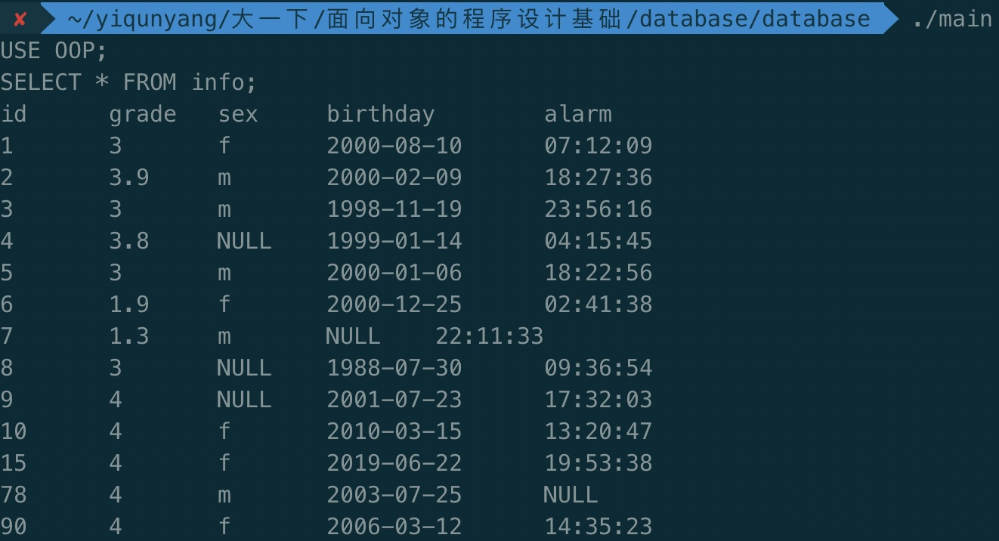
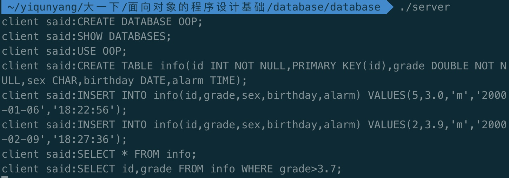
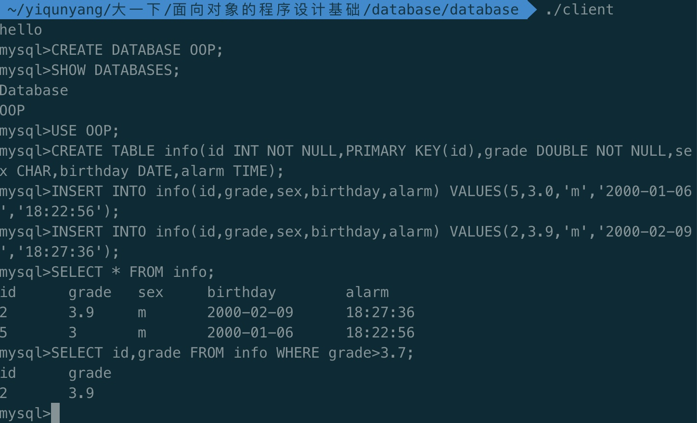
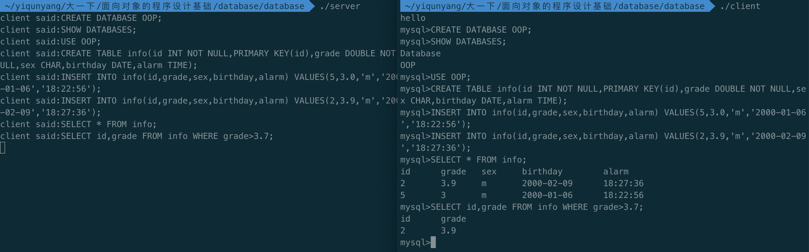

# 大作业第二阶段_实验报告  
本报告将展示说明文档中的所有功能，测例代码见input.txt
本地SQL服务器的编译命令是`make`或者`make release`


## 读写文件
下面一段测例展示`INTO OUTFILE`和`LOAD DATA INFILE`的功能
```sql
CREATE DATABASE OOP;
USE OOP;
CREATE TABLE info(id INT NOT NULL,PRIMARY KEY(id),grade DOUBLE NOT NULL,
sex CHAR,birthday DATE,alarm TIME);
INSERT INTO info(id,grade,sex,birthday,alarm) VALUES(5,3.0,'m','2000-01-06','18:22:56');
INSERT INTO info(id,grade,sex,birthday,alarm) VALUES(2,3.9,'m','2000-02-09','18:27:36');
INSERT INTO info(id,grade,sex,birthday,alarm) VALUES(1,3.0,'f','2000-08-10','07:12:09');
INSERT INTO info(id,grade,birthday,alarm) VALUES(4,3.8,'1999-01-14','04:15:45');
SELECT id, grade, sex INTO OUTFILE 'output_file' FROM info WHERE grade<3.3;
LOAD DATA INFILE 'load_in_file' INTO TABLE info(id,grade,sex,alarm);
SELECT * FROM info;
```
执行`INTO OUTFILE`得到`output_file`的内容为：
```
1   3   f  
5   3   m
```
`load_in_file`文件中的内容是：  
```
43 4.0 m 18:22:33
66 3.1 f 21:22:06
```

执行最后两条SQL语句后得到了正确的结果：
```sql
LOAD DATA INFILE 'load_in_file' INTO TABLE info(id,grade,sex,alarm);
SELECT * FROM info;
id	grade	sex	birthday	alarm
1	3	f	2000-08-10	07:12:09
2	3.9	m	2000-02-09	18:27:36
4	3.8	NULL	1999-01-14	04:15:45
5	3	m	2000-01-06	18:22:56
43	4	m	NULL	18:22:33
66	3.1	f	NULL	21:22:06
```

## 存档、查询
下面的测例基于如下的创建数据库、插入操作：
```sql
CREATE DATABASE OOP;
USE OOP;
CREATE TABLE info(id INT NOT NULL,PRIMARY KEY(id),grade DOUBLE NOT NULL,
sex CHAR,birthday DATE,alarm TIME);
INSERT INTO info(id,grade,sex,birthday,alarm) VALUES(5,3.0,'m','2000-01-06','18:22:56');
INSERT INTO info(id,grade,sex,birthday,alarm) VALUES(2,3.9,'m','2000-02-09','18:27:36');
INSERT INTO info(id,grade,sex,birthday,alarm) VALUES(1,3.0,'f','2000-08-10','07:12:09');
INSERT INTO info(id,grade,birthday,alarm) VALUES(4,3.8,'1999-01-14','04:15:45');
INSERT INTO info(id,grade,sex,birthday,alarm) VALUES(3,3.0,'m','1998-11-19','23:56:16');
INSERT INTO info(id,grade,sex,birthday,alarm) VALUES(6,1.9,'f','2000-12-25','02:41:38');
INSERT INTO info(id,grade,birthday,alarm) VALUES(9,4.0,'2001-07-23','17:32:03');
INSERT INTO info(id,grade,sex,birthday,alarm) VALUES(10,4.0,'f','2010-03-15','13:20:47');
INSERT INTO info(id,grade,sex,alarm) VALUES(7,1.3,'m','22:11:33');
INSERT INTO info(id,grade,birthday,alarm) VALUES(8,3.0,'1988-07-30','09:36:54');
INSERT INTO info(id,grade,sex,birthday,alarm) VALUES(90,4.0,'f','2006-03-12','14:35:23');
INSERT INTO info(id,grade,sex,birthday) VALUES(78,4.0,'m','2003-07-25');
INSERT INTO info(id,grade,sex,birthday,alarm) VALUES(15,4.0,'f','2019-06-22','19:53:38');
```
向程序输入这些命令后关闭程序。再次打开程序，直接输入查询语句可以得到正确的输出，说明**存档、读档**功能正常


下面将会展示第二阶段开发的各种**查询功能**，并与标准mysql输出进行对比  

1. 实现`COUNT`函数， `GROUP BY`多列分组，`ORDER BY`排序
```sql
SELECT sex,grade,COUNT(*) FROM info WHERE birthday>2000-01-01 AND id<10 GROUP BY sex,grade ORDER BY grade;
sex     grade   COUNT(*)
f       1.9     1
f       3       1
m       3       2
NULL    3       1
NULL    3.8     1
m       3.9     1
NULL    4       1
```
对比标准输出
```
+------+-------+----------+
| sex  | grade | COUNT(*) |
+------+-------+----------+
| f    |   1.9 |        1 |
| f    |     3 |        1 |
| m    |     3 |        2 |
| NULL |     3 |        1 |
| NULL |   3.8 |        1 |
| m    |   3.9 |        1 |
| NULL |     4 |        1 |
+------+-------+----------+
```

2. 实现COUNT(DISTINCT 列名) 查找数据不一样且不为空的行数
```sql
SELECT COUNT(DISTINCT sex),grade from info GROUP BY grade ORDER BY grade;
COUNT(DISTINCT sex)     grade
1       1.3
1       1.9
2       3
0       3.8
1       3.9
2       4
```
对比标准输出
```
+---------------------+-------+
| COUNT(DISTINCT sex) | grade |
+---------------------+-------+
|                   1 |   1.3 |
|                   1 |   1.9 |
|                   2 |     3 |
|                   0 |   3.8 |
|                   1 |   3.9 |
|                   2 |     4 |
+---------------------+-------+
```

3. 实现ORDER BY升序降序排列，ORDER BY之后DESC为降序，ASC为升序，默认为升序，完全仿照mysql
```sql
SELECT id,grade,sex from info ORDER BY id ASC;
id      grade   sex
1       3       f
2       3.9     m
3       3       m
4       3.8     NULL
5       3       m
6       1.9     f
7       1.3     m
8       3       NULL
9       4       NULL
10      4       f
15      4       f
78      4       m
90      4       f

SELECT id,grade,sex from info ORDER BY id DESC;
id      grade   sex
90      4       f
78      4       m
15      4       f
10      4       f
9       4       NULL
8       3       NULL
7       1.3     m
6       1.9     f
5       3       m
4       3.8     NULL
3       3       m
2       3.9     m
1       3       f
```
对比标准输出
```
+----+-------+------+
| id | grade | sex  |
+----+-------+------+
| 90 |     4 | f    |
| 78 |     4 | m    |
| 15 |     4 | f    |
| 10 |     4 | f    |
|  9 |     4 | NULL |
|  8 |     3 | NULL |
|  7 |   1.3 | m    |
|  6 |   1.9 | f    |
|  5 |     3 | m    |
|  4 |   3.8 | NULL |
|  3 |     3 | m    |
|  2 |   3.9 | m    |
|  1 |     3 | f    |
+----+-------+------+

+----+-------+------+
| id | grade | sex  |
+----+-------+------+
|  1 |     3 | f    |
|  2 |   3.9 | m    |
|  3 |     3 | m    |
|  4 |   3.8 | NULL |
|  5 |     3 | m    |
|  6 |   1.9 | f    |
|  7 |   1.3 | m    |
|  8 |     3 | NULL |
|  9 |     4 | NULL |
| 10 |     4 | f    |
| 15 |     4 | f    |
| 78 |     4 | m    |
| 90 |     4 | f    |
+----+-------+------+
```

4. 实现AS关键字可以对列指定别名
```sql
SELECT id AS xx, grade, sex AS xxx FROM info ODER BY id;
xx      grade   xxx
1       3       f
2       3.9     m
3       3       m
4       3.8     NULL
5       3       m
6       1.9     f
7       1.3     m
8       3       NULL
9       4       NULL
10      4       f
15      4       f
78      4       m
90      4       f
```
对比标准输出
```
+----+-------+------+
| xx | grade | xxx  |
+----+-------+------+
|  1 |     3 | f    |
|  2 |   3.9 | m    |
|  3 |     3 | m    |
|  4 |   3.8 | NULL |
|  5 |     3 | m    |
|  6 |   1.9 | f    |
|  7 |   1.3 | m    |
|  8 |     3 | NULL |
|  9 |     4 | NULL |
| 10 |     4 | f    |
| 15 |     4 | f    |
| 78 |     4 | m    |
| 90 |     4 | f    |
+----+-------+------+
```

5. 实现MAX，MIN函数
```sql
SELECT MAX(grade),MIN(grade),COUNT(*) from info GROUP BY sex ORDER BY COUNT(*);
MAX(grade)      MIN(grade)      COUNT(*)
4       3       3
4       1.9     5
4       1.3     5
```
对比标准输出
```
+------------+------------+----------+
| MAX(grade) | MIN(grade) | COUNT(*) |
+------------+------------+----------+
|          4 |          3 |        3 |
|          4 |        1.9 |        5 |
|          4 |        1.3 |        5 |
+------------+------------+----------+
```

6. 单纯的计算器举例
```sql
SELECT NOT 1 XOR 1 AND 1;
NOT 1 XOR 1 AND 1
1
SELECT ABS(SQRT(3)-7)*6+TAN(COS(-5));
ABS(SQRT(3)-7)*6+TAN(COS(-5))
31.899219
```
对比标准输出
```
+-------------------+
| NOT 1 XOR 1 AND 1 |
+-------------------+
|                 1 |
+-------------------+

+-------------------------------+
| ABS(SQRT(3)-7)*6+TAN(COS(-5)) |
+-------------------------------+
|            31.899218680335512 |
+-------------------------------+
```

7. 实现逻辑运算符，算数运算符与列名相结合
```sql
SELECT grade,NOT grade AND 9 XOR (grade-3) from info WHERE id<10;
grade   NOT grade AND 9 XOR (grade-3)
3       0
3.9     1
3       0
3.8     1
3       0
1.9     1
1.3     1
3       0
4       1

SELECT id,grade,id/(grade*3) from info;
id      grade   id/(grade*3)
1       3       0.111111
2       3.9     0.17094
3       3       0.333333
4       3.8     0.350877
5       3       0.555556
6       1.9     1.05263
7       1.3     1.79487
8       3       0.888889
9       4       0.75
10      4       0.833333
15      4       1.25
78      4       6.5
90      4       7.5
```
对比标准输出
```
+-------+-------------------------------+
| grade | NOT grade AND 9 XOR (grade-3) |
+-------+-------------------------------+
|     3 |                             0 |
|   3.9 |                             1 |
|     3 |                             0 |
|   3.8 |                             1 |
|     3 |                             0 |
|   1.9 |                             1 |
|   1.3 |                             1 |
|     3 |                             0 |
|     4 |                             1 |
+-------+-------------------------------+

+----+-------+---------------------+
| id | grade | id/(grade*3)        |
+----+-------+---------------------+
|  1 |     3 |  0.1111111111111111 |
|  2 |   3.9 | 0.17094017094017094 |
|  3 |     3 |  0.3333333333333333 |
|  4 |   3.8 |  0.3508771929824562 |
|  5 |     3 |  0.5555555555555556 |
|  6 |   1.9 |  1.0526315789473686 |
|  7 |   1.3 |  1.7948717948717947 |
|  8 |     3 |  0.8888888888888888 |
|  9 |     4 |                0.75 |
| 10 |     4 |  0.8333333333333334 |
| 15 |     4 |                1.25 |
| 78 |     4 |                 6.5 |
| 90 |     4 |                 7.5 |
+----+-------+---------------------+
13 rows in set (0.00 sec)
```

8. 当除0或余除0时返回`NULL`
```sql
SELECT 10*(id+grade)%(100*(grade-4)),10*(id+grade)/(100*(grade-4)) from info;
10*(id+grade)%(100*(grade-4))   10*(id+grade)/(100*(grade-4))
40      -0.4
50      -5.9
60      -0.6
70      -3.9
80      -0.8
70      -0.37619
80      -0.307407
110     -1.1
NULL    NULL
NULL    NULL
NULL    NULL
NULL    NULL
NULL    NULL
```
对比标准输出
```
+-------------------------------+-------------------------------+
| 10*(id+grade)%(100*(grade-4)) | 10*(id+grade)/(100*(grade-4)) |
+-------------------------------+-------------------------------+
|                            40 |                          -0.4 |
|             8.999999999999956 |            -5.899999999999995 |
|                            60 |                          -0.6 |
|            17.999999999999947 |           -3.8999999999999964 |
|                            80 |                          -0.8 |
|                            79 |           -0.3761904761904762 |
|                            83 |           -0.3074074074074074 |
|                            10 |                          -1.1 |
|                          NULL |                          NULL |
|                          NULL |                          NULL |
|                          NULL |                          NULL |
|                          NULL |                          NULL |
|                          NULL |                          NULL |
+-------------------------------+-------------------------------+
```

9. 实现多种数字函数与列名相结合
```sql
SELECT SIN(id),COS(id),TAN(id),SQRT(id),FLOOR(id) FROM info WHERE id<20 ORDER BY TAN(id);
SIN(id) COS(id) TAN(id) SQRT(id)        FLOOR(id)
0.989358        -0.1455 -6.79971        2.82843 8
-0.958924       0.283662        -3.38052        2.23607 5
0.909297        -0.416147       -2.18504        1.41421 2
0.650288        -0.759688       -0.855993       3.87298 15
0.412118        -0.91113        -0.452316       3       9
-0.279415       0.96017 -0.291006       2.44949 6
0.14112 -0.989992       -0.142547       1.73205 3
-0.544021       -0.839072       0.648361        3.16228 10
0.656987        0.753902        0.871448        2.64575 7
-0.756802       -0.653644       1.15782 2       4
0.841471        0.540302        1.55741 1       1

```

10. 数字函数、列名、算数运算符与`ORDER BY`结合，`ORDER BY`后可以有运算式
```sql
SELECT tan(SQRT(id*(id+3))/abs(grade-SIN(-id*grade))) from info ORDER BY ABS(TAN(id+grade));
tan(SQRT(id*(id+3))/abs(grade-SIN(-id*grade)))
3.67591
-0.42329
2.94452
-0.044192
0.753214
0.323685
0.739451
-2.04372
-6.1256
-0.910802
2.86049
2.65127
4.20587
```

11. 实现DATE和TIME类型 且`DATE`和`TIME`支持已有的比较操作符  
```sql
SELECT * from info WHERE sex='m' ORDER BY birthday DESC;
id      grade   sex     birthday        alarm
78      4       m       2003-07-25      NULL
2       3.9     m       2000-02-09      18:27:36
5       3       m       2000-01-06      18:22:56
3       3       m       1998-11-19      23:56:16
7       1.3     m       NULL    22:11:33
SELECT * from info WHERE id<8 ORDER BY alarm ASC;
id      grade   sex     birthday        alarm
6       1.9     f       2000-12-25      02:41:38
4       3.8     NULL    1999-01-14      04:15:45
1       3       f       2000-08-10      07:12:09
5       3       m       2000-01-06      18:22:56
2       3.9     m       2000-02-09      18:27:36
7       1.3     m       NULL    22:11:33
3       3       m       1998-11-19      23:56:16
```

12. 实现`CURTIME(),CURDATE()`函数，返回当前时间和日期。实现`ADDTIME(),ADDDATE()`，并可与`CURTIME(),CURDATE()`结合，其中`ADDTIME()`完全仿照mysql，101为1分1秒
```sql
SELECT ADDDATE(birthday,10000),ADDDATE(CURDATE(),1000) from info WHERE birthday>'2000-03-01';
ADDDATE(birthday,10000) ADDDATE(CURDATE(),1000)
2027-12-27      2022-03-19
2028-05-11      2022-03-19
2028-12-08      2022-03-19
2037-07-31      2022-03-19
2046-11-07      2022-03-19
2030-12-10      2022-03-19
2033-07-28      2022-03-19
SELECT ADDTIME(alarm,10000),ADDTIME(CURTIME(),101) from info WHERE grade>3.0;
ADDTIME(alarm,10000)    ADDTIME(CURTIME(),101)
19:27:36        15:55:08
05:15:45        15:55:08
18:32:03        15:55:08
14:20:47        15:55:08
20:53:38        15:55:08
NULL    15:55:08
15:35:23        15:55:08
```

13. `ADDDATE()`中可以有计算式或者其他列列名
```sql
SELECT id, birthday, ADDDATE(birthday,id*id) from info;
id      birthday        ADDDATE(birthday,id*id)
1       2000-08-10      2000-08-11
2       2000-02-09      2000-02-13
3       1998-11-19      1998-11-28
4       1999-01-14      1999-01-30
5       2000-01-06      2000-01-31
6       2000-12-25      2001-01-30
7       NULL    NULL
8       1988-07-30      1988-10-02
9       2001-07-23      2001-10-12
10      2010-03-15      2010-06-23
15      2019-06-22      2020-02-02
78      2003-07-25      2020-03-21
90      2006-03-12      2028-05-15
```
14.当指定不不合法的MySQL不不能表示的值时使⽤"零"值
DROP DATABASE OOP;
```sql
CREATE DATABASE OOP;
USE OOP;
CREATE TABLE info(id INT NOT NULL,PRIMARY KEY(id),grade DOUBLE NOT NULL,
sex CHAR,birthday DATE,alarm TIME);
INSERT INTO info(id,grade,sex,birthday,alarm) VALUES(5,3.0,'m','1999-02-29','18:22:56');
INSERT INTO info(id,grade,sex,birthday,alarm) VALUES(2,3.9,'m','2000-02-09','18:61:36');
INSERT INTO info(id,grade,sex,birthday,alarm) VALUES(1,3.0,'f','2000-08-10','07:12:09');
```
测试结果为：
```sql
SELECT * FROM info;
id	grade	sex	birthday	alarm
1	3	f	2000-08-10	07:12:09
2	3.9	m	2000-02-09	00:00:00
5	3	m	0000-00-00	18:22:56
```

## 远程访问功能
远程访问请使用编译命令`make remote`编译出`server`和`client`两个可执行文件。（本功能仅在MacOS可用）
首先运行`server`，再运行`client`，`server`会首先向`client`进行问候，接着两个程序可以进行交互。在`server`执行SQL语句并在`client`中输出。(程序目前使用的是本地的IP地址127.0.0.1)  
  

  

